# Travel Tracker

> Stay compliant with the EU Schengen **90/180-day rule** — an Android app for visa & trip tracking, built with Jetpack Compose and a modular Clean Architecture.


-3DDC84?logo=android&logoColor=white)


<table>
  <tr>
    <td align="center"><b>Light theme</b></td>
    <td align="center"><b>Dark theme</b></td>
  </tr>
  <tr>
    <td>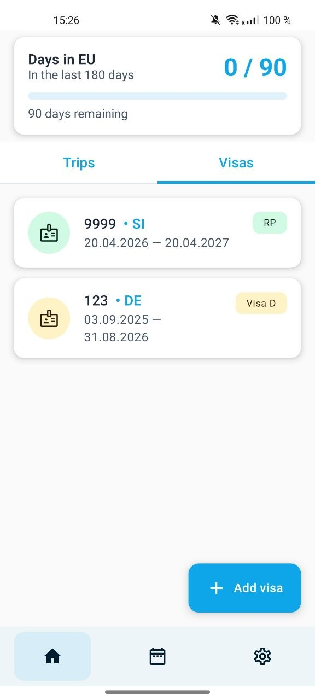</td>
    <td>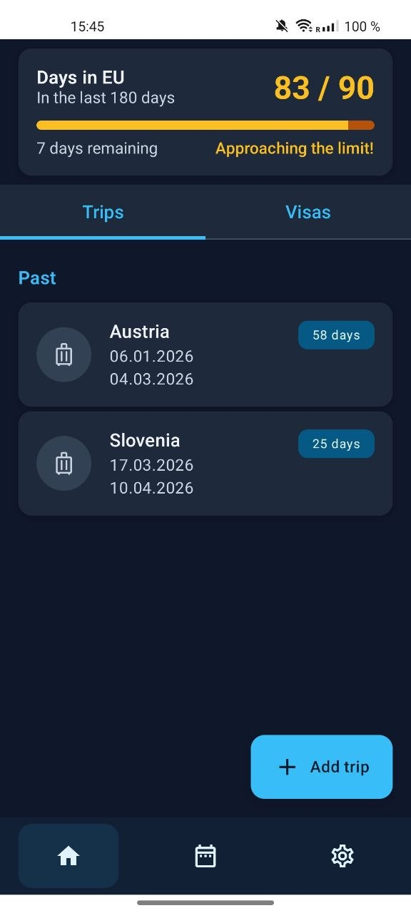</td>
  </tr>
</table>

---

## About

Anyone travelling around the Schengen Area on a visa or residence permit eventually meets the **90/180-day rule**: you may not spend more than 90 days in the EU within any rolling 180-day window. The rule is easy to *state* and surprisingly hard to *track* — a single past trip silently shifts the budget for every future trip.

Spreadsheets are clunky. Most existing apps are paywalled, ad-heavy, or treat the calendar as an afterthought. **Travel Tracker** solves exactly one problem well: store your visas and trips, compute the rolling window in real time, and warn you before you cross the limit — visually, on a custom calendar that shows the remaining-day budget for every single date.

---

## Tech stack

| Area            | Choice                                          | Why                                                                |
| --------------- | ----------------------------------------------- | ------------------------------------------------------------------ |
| Language        | Kotlin 2.1.21                                   | Coroutines + Flow, null-safety, KSP support.                       |
| UI              | Jetpack Compose (BOM 2025.06) + Material 3      | 100% Compose, no XML layouts.                                      |
| DI              | Hilt 2.56                                       | First-class Android integration, KSP-backed.                       |
| Persistence     | Room 2.7 + DataStore 1.1                        | Typed SQLite for trips/visas; DataStore for preferences.           |
| Async / state   | Kotlin Coroutines + Flow                        | Reactive repository layer, structured concurrency.                 |
| Architecture    | MVI + multi-module Clean Architecture           | Clear edges between domain, data, and UI.                          |
| Navigation      | Navigation Compose 2.9 + Hilt Nav Compose       | Type-safe routes, DI-aware view-model creation.                    |
| Internationalisation | `values-ru/` + Android 13 `locale_config` | Runtime language switching without restart.                        |
| Build           | Gradle KTS + version catalog (`libs.versions.toml`) | Single source of truth for dependency versions.                |
| JVM target      | Java 21                                         | Matches AGP 8.8 / Kotlin 2.1 defaults.                             |

---

## Architecture

The codebase is split into **core** modules (reusable across features) and **feature** modules (one per top-level screen). Feature modules depend only on `core:*`; core modules don't know features exist. This dependency direction is enforced by the Gradle wiring and pays off as parallel build wins.

```
traveltracker/
├── app/                  # entry point, DI graph, navigation host
├── core/
│   ├── common/           # extensions, utilities
│   ├── domain/           # models, repository interfaces, use cases
│   ├── data/             # Room, DataStore, repository impls, mappers
│   └── ui/               # MVI base classes, theme, shared components
├── feature/
│   ├── home/             # visa & trip CRUD, days-in-EU header
│   ├── calendar/         # custom calendar screen
│   └── settings/         # theme, language, date format
└── build-setups/         # shared Gradle convention scripts
```

The domain layer holds the **EU rule constants** in [`Const.kt`](core/domain/src/main/java/ru/nikfirs/android/traveltracker/core/domain/Const.kt) — `PERIOD_DAYS = 180`, `MAX_STAY_DAYS = 90`, `WARNING_THRESHOLD = 75` — the single place that codifies the rule.

---

## Engineering highlights

The parts of the codebase that were the most interesting to design.

### MVI on Kotlin Flow

`core:ui` ships a tiny base class [`ViewModel<A : MviAction, E : MviEffect, S : MviState>`](core/ui/src/main/java/ru/nikfirs/android/traveltracker/core/ui/mvi/ViewModel.kt) that wires together:

- a **`MutableSharedFlow<A>`** for actions (user intents),
- a **`Channel<E>`** for one-shot effects (navigation, toasts, snackbars),
- a **`MutableStateFlow<S>`** for the rendered state.

Every screen is a pure function of `S`, every interaction emits an `A`, every navigation is an `E`. Strict MVI keeps screens with several async edges (DB watches, user input, timed warnings) deterministic and easy to test — state transitions are total functions, not scattered `LiveData` mutations.

### Rolling 180-day window via recursive CTE in Room

The day counter in [`VisaDao.kt`](core/data/src/main/java/ru/nikfirs/android/traveltracker/core/data/database/dao/VisaDao.kt) uses a SQLite `WITH RECURSIVE` query to enumerate the days of the rolling window and count the non-exempt ones directly in the database, instead of pulling all trip rows into Kotlin and folding them. Two benefits:

1. **Speed** — the per-date remaining-day badges on the calendar stay cheap even with dozens of trips.
2. **Single source of truth** — the rule is encoded once, in SQL, and reused by every consumer.

### Custom scrollable calendar

The calendar is hand-built in Compose: [`CustomCalendar.kt`](core/ui/src/main/java/ru/nikfirs/android/traveltracker/core/ui/ui/component/CustomCalendar.kt) renders months inside a `LazyColumn`, with each day cell drawing its own remaining-day badge and change-indicator dot. The same primitives are reused by [`CustomCalendarRangePicker.kt`](core/ui/src/main/java/ru/nikfirs/android/traveltracker/core/ui/ui/component/CustomCalendarRangePicker.kt) for trip date selection.

The component exposes a **calculation-progress callback** so callers can show a loading shimmer while per-day budgets are being computed — important on first load when the database has many trips.

### Multi-module Gradle setup

The build wires Kotlin 2.1, AGP 8.8.2, KSP for Room/Hilt, and the Compose compiler plugin via a version catalog ([`gradle/libs.versions.toml`](gradle/libs.versions.toml)) and shared convention scripts in [`build-setups/`](build-setups/) (`app.gradle`, `base.gradle`, `compose.gradle`, `ext.gradle`). A new feature module is two lines in `settings.gradle.kts` plus an `apply from:` to the relevant convention — no Gradle copy-paste.

---

## Features

### Visa management


- Supports **Visa C, Visa D, and residence permits**, each with its own validity rules.
- Tracks **single / double / multi-entry** visas — the app knows when a visa is exhausted by past trips.
- Active-state flag lets you keep historical visas without cluttering the trip-creation flow.
- Country code chips and category badges (`RP`, `Visa D`) keep the list scannable.

<br clear="right">

### Trips with multi-country segments

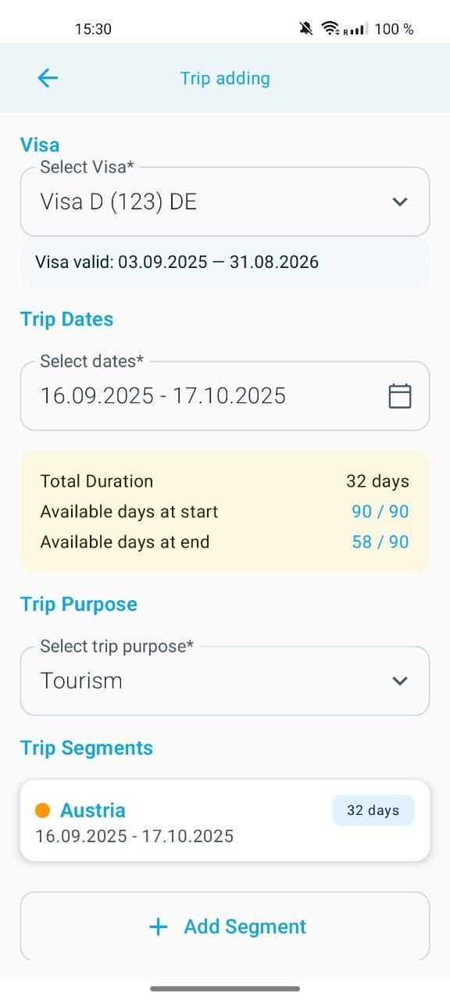

- Each trip is bound to a specific **visa**, with date-range and purpose (tourism / business / family / medical / education / other).
- A trip can be split into **per-country segments** — useful when one journey crosses Austria, Slovenia, and Hungary on a single visa.
- The form previews **available days at start and at end** of the trip in real time (`90/90 → 58/90`), so over-budget plans are caught *before* you save.
- Segments can be marked **exempt**, which the day counter then excludes from the rolling window.

<br clear="right">

### Rolling 90/180 enforcement, with three visual states

<table>
  <tr>
    <td align="center"><b>Safe</b></td>
    <td align="center"><b>Approaching the limit</b></td>
    <td align="center"><b>Limit exceeded</b></td>
  </tr>
  <tr>
    <td>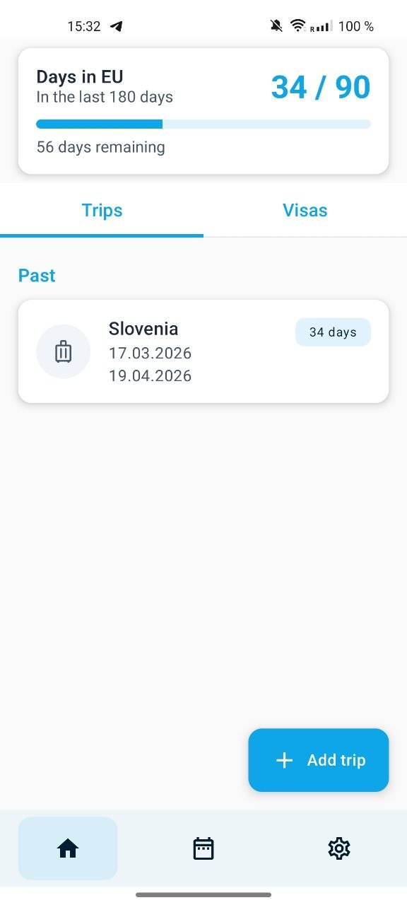</td>
    <td></td>
    <td>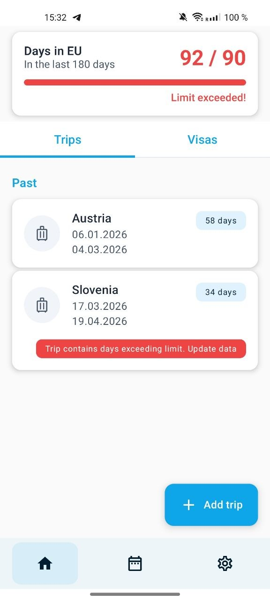</td>
  </tr>
</table>

- The Home header always shows **`days used / 90`** plus a progress bar coloured by severity (blue → amber → red).
- A **per-trip inline warning** appears on any trip that pushes the rolling window over 90, pinpointing *which* trip is the culprit — not just *that* you're over.
- A configurable warning threshold (75 days by default) drives the amber "Approaching the limit!" state.

### Custom calendar

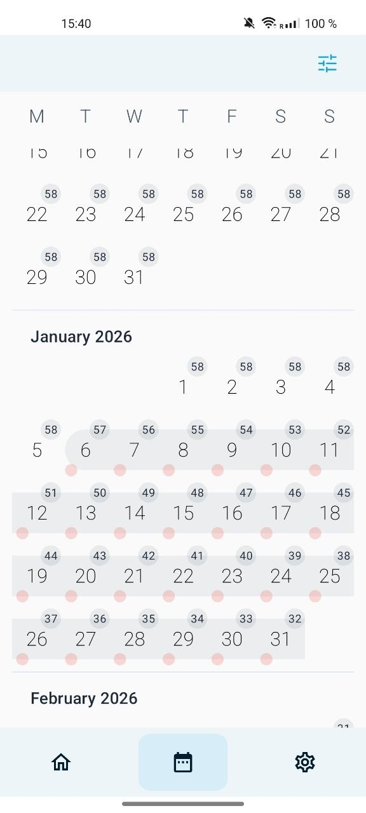

- A scrollable, month-based grid where every date is annotated with the **remaining-day budget** at that specific date.
- **Change-indicator dots** below each date — red when a day is spent, green when 180 days have rolled over and days are restored — turn the rolling window into something you can *see*.
- Trip ranges are highlighted as continuous bands so multi-day stays are obvious at a glance.
- Built from scratch in Compose — no third-party calendar library.

<br clear="right">

### Calendar filters & day detail

<table>
  <tr>
    <td>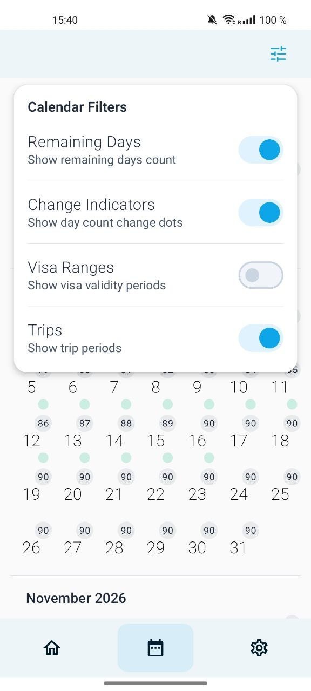</td>
    <td>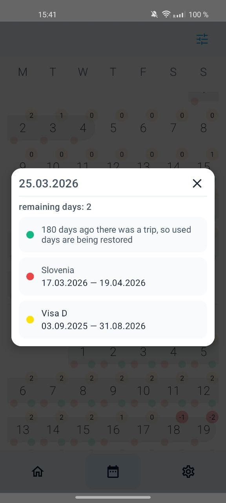</td>
  </tr>
</table>

- Four independent toggles let you focus the calendar on what matters today: **Remaining Days**, **Change Indicators**, **Visa Ranges**, **Trips**.
- Tap any date for a **full breakdown**: the active visa, any trip covering that day, and a plain-English explanation of *why* the budget is changing — for example, *"180 days ago there was a trip, so used days are being restored"*. This turns the rule from arithmetic into a story.

### Range picker

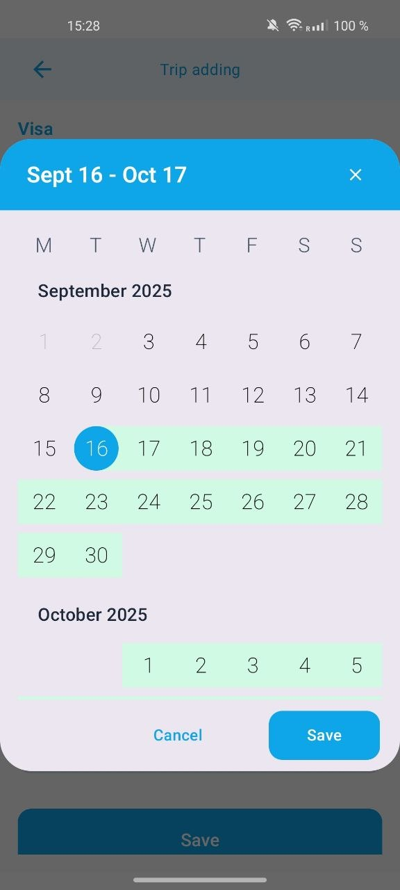

The same custom calendar component doubles as the **trip range picker** — a continuous two-month scrollable view with a highlighted selection band, replacing the stock single-day Material picker that doesn't handle multi-month ranges well.

<br clear="right">

### Theming & localisation

<table>
  <tr>
    <td>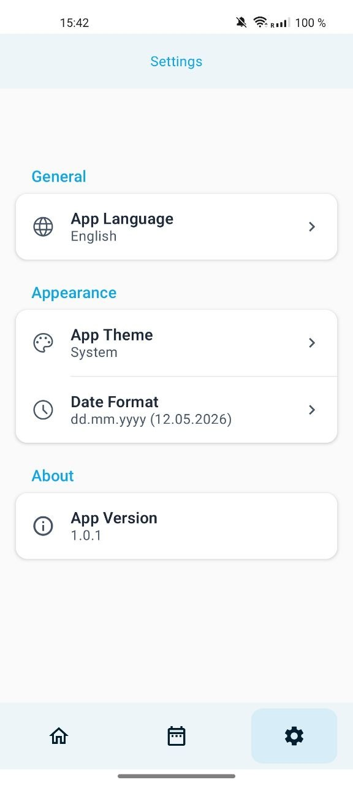</td>
    <td>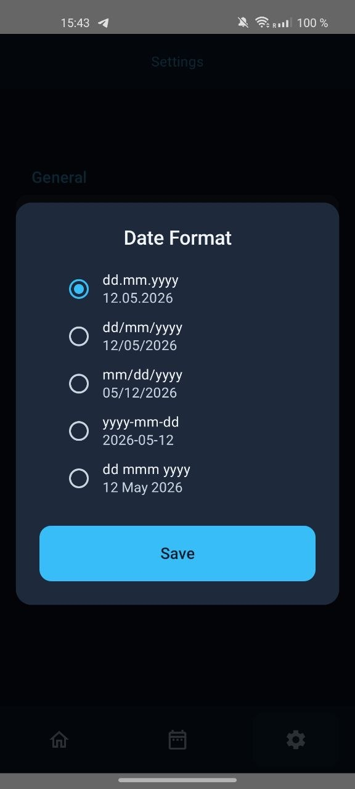</td>
  </tr>
</table>

- **System / Light / Dark** theme, persisted via DataStore — every screen is themed, including the custom calendar.
- **English + Russian** out of the box (`values/` + `values-ru/`), with runtime language switching via `locale_config`.
- **Five date formats** (`dd.mm.yyyy`, `dd/mm/yyyy`, `mm/dd/yyyy`, `yyyy-mm-dd`, `dd mmm yyyy`) so the app matches your local convention.

---

## Screenshots

<table>
  <tr>
    <td>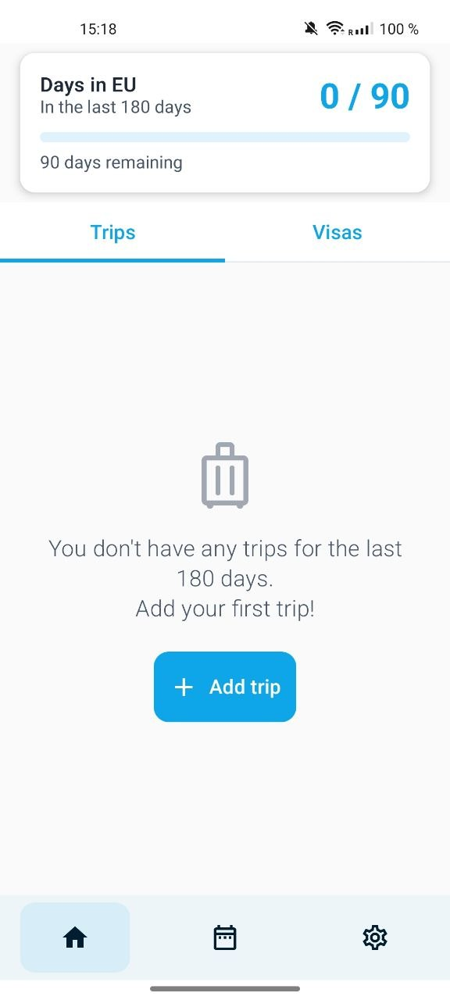<br><sub align="center">Empty state · bottom navigation</sub></td>
    <td><br><sub>Visa list</sub></td>
    <td><br><sub>Custom range picker</sub></td>
    <td><br><sub>Trip form · segments</sub></td>
  </tr>
  <tr>
    <td><br><sub>One past trip</sub></td>
    <td><br><sub>Limit exceeded</sub></td>
    <td><br><sub>Calendar screen</sub></td>
    <td><br><sub>Calendar filters</sub></td>
  </tr>
  <tr>
    <td><br><sub>Day detail popup</sub></td>
    <td><br><sub>Settings</sub></td>
    <td><br><sub>Date format · dark</sub></td>
    <td><br><sub>Approaching · dark</sub></td>
  </tr>
</table>

---

## Build & run

```bash
git clone <repo-url>
cd traveltracker
./gradlew :app:installDebug
```

**Requirements**

- JDK **21**
- Android Studio Ladybug or newer (AGP 8.8.2)
- An Android **8.0+ (API 26)** device or emulator

---

## Roadmap

*Ideas being explored, not commitments:*

- Cloud backup / cross-device sync for visas and trips
- Home-screen widget showing "days remaining in EU"
- iCal export so planned trips land in Google / Apple Calendar
